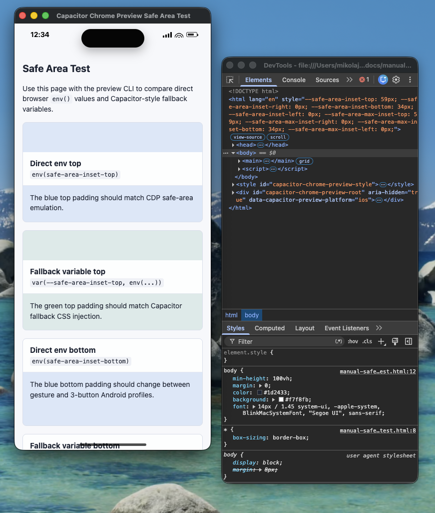
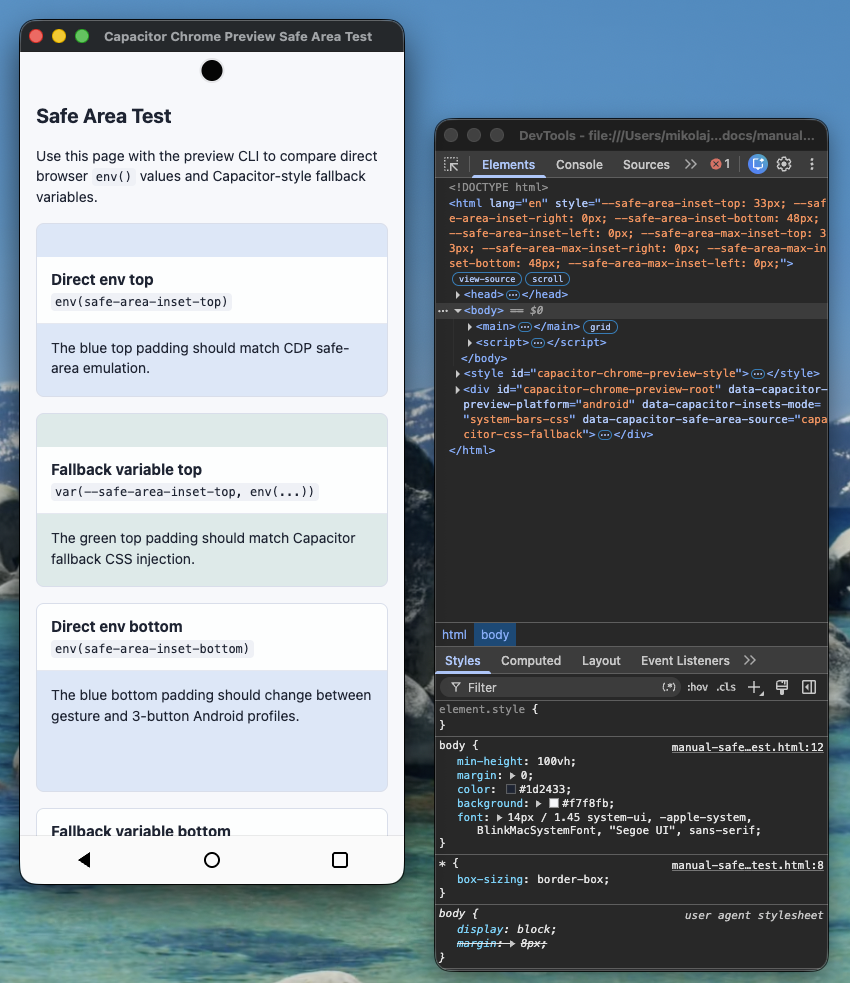

# Capacitor Chrome Preview

Capacitor Chrome Preview is an early working prototype for previewing Capacitor
and other WebView-based hybrid apps in Chrome.

The prototype helps web developers catch safe-area, Dynamic Island, notch, status bar, and bottom system-bar layout issues without starting Xcode, Android Studio, or a native simulator.

Current support is macOS with Google Chrome. Linux, Windows, and other Chromium browsers are planned after the Chrome/CDP path is stable.

This is an independent, unofficial project. It is not affiliated with or
endorsed by Ionic, Capacitor, Apple, Google, or Samsung.

## Why This Exists

Hybrid app teams often split work between web developers in the browser and mobile maintainers who catch native-container layout issues later. Normal desktop browsers do not show full-screen WebView safe areas, so these bugs are easy to miss.

This tool is not a real-device replacement. It is a fast Chrome workflow for catching common layout mistakes earlier.

## Preview

| iPhone 15 Pro | Galaxy A54 with three-button navigation |
| --- | --- |
|  |  |

## Current Prototype

The CLI launches a dedicated Chrome profile, opens the target URL in a small app-mode Chrome window, applies mobile emulation through Chrome DevTools Protocol, and injects visual overlays for unsafe areas and hardware UI.

A normal Chrome window or tab can add browser UI and docked DevTools space that changes the page viewport. To keep the content size stable, the prototype starts Chrome with `--app=<loading-url>`, navigates to the app, removes the loading page from that target's history, and applies CDP `Browser.setContentsSize` with `Emulation.setDeviceMetricsOverride`.

Safe-area behavior uses two layers:

- CDP `Emulation.setSafeAreaInsetsOverride` is the preferred path because it changes `env(safe-area-inset-*)` and `env(safe-area-max-inset-*)`.
- The injected runtime draws overlays and sets Capacitor-style fallback variables such as `--safe-area-inset-top` so apps can debug fallback behavior when browser/native env values are not enough.

The terminal reports viewport verification, app-window sizing, CDP safe-area
support, mouse-to-touch support, and runtime injection separately. A verified
viewport does not imply that every other capability succeeded.

The Galaxy A54 profiles expose interactive Android navigation. Gesture mode accepts inward swipes from either 24px edge strip. Three-button mode provides Back, Home, and Recents controls. Both Back inputs first dispatch Ionic's documented `ionBackButton` priority handlers, allowing overlays such as `ion-modal` to dismiss. If no handler registers, the preview falls back to safe same-app browser history. Home and Recents show preview-only feedback because Chrome cannot reproduce Android launcher or task-switcher behavior.

## Quick Start

Prerequisites:

- macOS;
- stable Google Chrome;
- Node.js 24.15 or newer with npm.

Open the bundled safe-area test page:

```sh
npx capacitor-chrome-preview
```

Choose a device profile:

```sh
npx capacitor-chrome-preview --device iphone-13
```

Keep site logins between runs:

```sh
npx capacitor-chrome-preview --persist-session http://localhost:4200
```

When running in an interactive terminal:

- Use arrow keys and Enter to select a device.
- Press `1-9` to switch directly.
- Press `r` to restore the active device size and emulation after resizing or tampering with Chrome.
- Press `o` to return to the launch URL.
- Press `q` to reset, close the preview Chrome window, and exit.

By default, each run gets an isolated Chrome profile under
`.tmp/chrome-preview-profile/<launch-id>`. After Chrome confirms exit, the CLI
removes that exact run directory. If Chrome cannot be confirmed stopped, the
directory is retained and its path is printed instead of risking live profile
data. The CLI refuses to start when its loopback debugging port is occupied. It
never attaches to or closes an existing Chrome session.

For the default temporary profile, `q` and terminal Ctrl+C perform the full
reset and normally remove the profile. An external `SIGINT`, `SIGTERM`, or
`SIGHUP` stops the owned Chrome process immediately; that abrupt path can retain
the run directory because the CLI may not remain alive long enough to confirm
exit.

`--persist-session` instead reuses the tool-owned project profile at
`.tmp/chrome-preview-profile/persistent`. Chrome keeps its cookies and site
storage there, so compatible site logins survive preview restarts. The CLI
never uses your normal Chrome profile. Treat this directory as sensitive local
data: do not commit, archive, or share it. Close the preview and remove the
directory when you want to sign out everywhere or reset the profile.

## Command Options

```sh
capacitor-chrome-preview [url] [--url <url>] [--device <device-id>] [--persist-session]
```

Arguments and flags:

- `url`: `http`, `https`, or `file` target URL. When omitted, the bundled
  safe-area test page opens. Embedded URL credentials are rejected.
- `--url <url>` or `--url=<url>`: explicit target URL. This takes precedence over a positional URL.
- `--device <device-id>` or `--device=<device-id>`: starting device profile.
- `--persist-session`: reuse a dedicated project-local Chrome profile so
  cookies and site storage survive between runs.
- `--help` or `-h`: print available devices.

Environment variables:

- `CAP_CHROME_PREVIEW_PORT`: loopback-only Chrome remote-debugging port. Defaults
  to `9229`. It must be a free integer port from `1` to `65535`.
- `CAP_CHROME_PREVIEW_STATUS_BAR_COLOR`: set to `white` for a white iOS-style status bar. Any other value uses black.
- `CHROME_PATH`: custom Chrome executable path.

Current device profiles:

- `iphone-15-pro`
- `iphone-13`
- `galaxy-a54`
- `galaxy-a54-3-button`

## Installation

Run the latest published version without installing it globally:

```sh
npx capacitor-chrome-preview
```

## What This Does Not Simulate

- native plugin implementations or a complete Capacitor runtime;
- a simulator's rendering engine, device hardware, launcher, or task switcher;
- exact operating-system artwork or every user display configuration;
- real-device performance, keyboard behavior, permissions, networking, or
  accessibility behavior.

Remote `http` and `https` targets make their normal network requests from the
dedicated Chrome profile. The CLI sends no telemetry and does not upload the
target URL or page data itself.

## Development

```sh
npm install
npm run setup:hooks
npm run typecheck
npm run build
npm test
npm run check
```

The tests cover CLI argument parsing, app-mode Chrome launch arguments, CDP emulation/reset calls, device reconfiguration, touch-input emulation, viewport verification, and injected runtime install/reset behavior.

Maintainers can validate device-profile geometry against physical iOS and
Android WebViews with the repo-only [Geometry Probe](tools/geometry-probe/).

`npm run setup:hooks` configures the tracked pre-commit hook for this repository
unless a different `core.hooksPath` is already set. The hook runs the same
checks as GitHub Actions through `npm run check`. CI uses a Linux runner because
the automated suite is platform-agnostic and does not launch Chrome. Manual
preview testing still requires macOS and Google Chrome.

## Documentation

- [Technical Approach](docs/technical-approach.md)
- [Technology Architecture](docs/technology-architecture.md)
- [Device Profile Research](docs/research/device-profiles.md)
- [Hardware Back Interaction Research](docs/research/hardware-back-interactions.md)
- [Persistent Chrome Profile Research](docs/research/persistent-chrome-profile.md)
- [Existing Solutions Research](docs/research/existing-solutions.md)
- [Manual Safe-Area Test Page](docs/manual-safe-area-test.html)
- [Regression Guardrails](docs/regression-guardrails.md)
- [Roadmap](ROADMAP.md)
- [Contributing](CONTRIBUTING.md)
- [Changelog](CHANGELOG.md)
- [Agent Instructions](AGENTS.md)

## Feedback And Security

Use [GitHub Issues](https://github.com/mikolajwilczek/capacitor-chrome-preview/issues)
for generic reproducible bugs and device-profile reports. Remove private URLs,
screenshots, logs, tokens, cookies, profile contents, and employer or client
code before posting. Report security problems privately as described in
[SECURITY.md](SECURITY.md).

## License

MIT. See [LICENSE](LICENSE).
